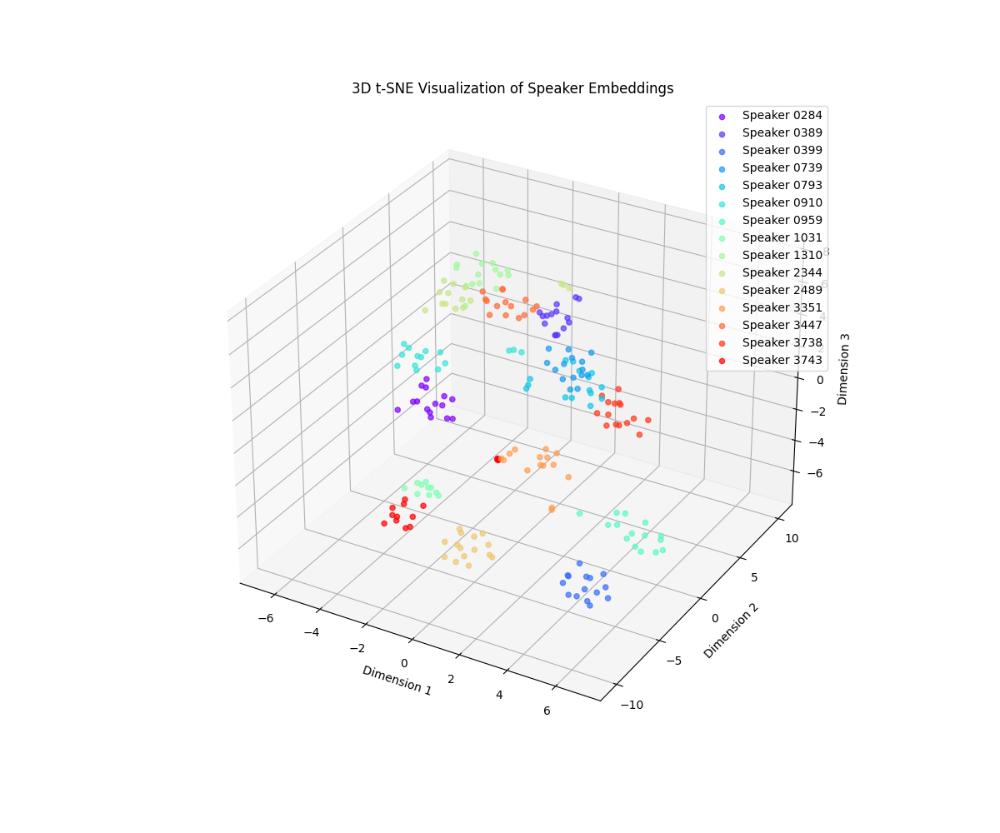

# Speech Verification Repository

음성 데이터를 기반으로 화자 인식 모델을 학습하고 사용하는 방법을 제공합니다. 한국어 음성 데이터셋인 AIHub의 화자 인식용 음성 데이터셋을 사용하여 학습을 진행했습니다.

## 데이터셋

- AIHub 화자 인식용 음성 데이터
- 데이터셋 링크: [AIHub 화자 인식 데이터셋](https://aihub.or.kr/aihubdata/data/view.do?currMenu=&topMenu=&aihubDataSe=data&dataSetSn=537)


## 모델 학습

1. 데이터셋을 준비합니다. AIHub에서 화자 인식 데이터셋을 다운로드하고, 데이터셋 경로를 `config` 폴더의 해당 모델 설정 파일(예: `wav2vec.yaml`)에 지정합니다.

2. 학습에 필요한 하이퍼파라미터를 `config` 폴더의 해당 모델 설정 파일에서 조정합니다. 학습 에폭 수, 배치 크기, 학습률 등을 설정할 수 있습니다.

## 학습 완료 모델

| Model Name | ROC AUC | Accuracy | inference time(sec) | Best Threshold | Link |
|------------|---------|----------|---------------------|----------------|------|
| wav2vec2-base-960h-contrastive | 0.9746 | 0.9324 | 0.0046 | 0.3331 | [Link](https://huggingface.co/Songhun/wav2vec2-base-960h-contrastive) |
| wav2vec2-large-960h-lv60-contrastive | 0.9819 | 0.9372 | 0.01 | 0.3728 | [Link](https://huggingface.co/Songhun/wav2vec2-large-960h-contrastive) |


## 사용 방법

```shell
python train.py --config config/wav2vec.yaml
```

<p align="center">
  
</p>

(동일 화자들의 임베딩끼리 뭉쳐짐)

학습된 모델은 finetuned_model 폴더에 생성됩니다.

## 음성 유사도 비교
import library
```shell
import librosa
import torch
import torch.nn.functional as F
from transformers import Wav2Vec2FeatureExtractor, Wav2Vec2Model
from torch.nn.functional import cosine_similarity
```

Load finetuned Model
```shell
device = torch.device("cuda" if torch.cuda.is_available() else "cpu")
model_name = "Songhun/wav2vec2-base-960h-contrastive"
model = Wav2Vec2Model.from_pretrained(model_name).to(device)
feature_extractor = AutoFeatureExtractor.from_pretrained(model_name)
model.eval()
```

Calculate Voice Similarity
```shell
file_path1 = './sample_data/voice1.mp3'
file_path2 = './sample_data/voice2.mp3'

feature_extractor = Wav2Vec2FeatureExtractor.from_pretrained(model_name)
def load_and_process_audio(file_path, feature_extractor, max_length=4.0):
    audio, sampling_rate = librosa.load(file_path, sr=16000)
    inputs = feature_extractor(audio, sampling_rate=sampling_rate, return_tensors="pt", padding="max_length", truncation=True, max_length=int(max_length * sampling_rate))
    return inputs.input_values.to(device)

audio_input1 = load_and_process_audio(file_path1, feature_extractor)
audio_input2 = load_and_process_audio(file_path2, feature_extractor)

embedding1 = model(audio_input1).last_hidden_state.mean(dim=1)
embedding2 = model(audio_input2).last_hidden_state.mean(dim=1)

similarity = F.cosine_similarity(embedding1, embedding2).item()
print(f"Similarity between the two audio files: {similarity}")
```

Threshold: 0.3331 is Youden's J statistic optimal threshold